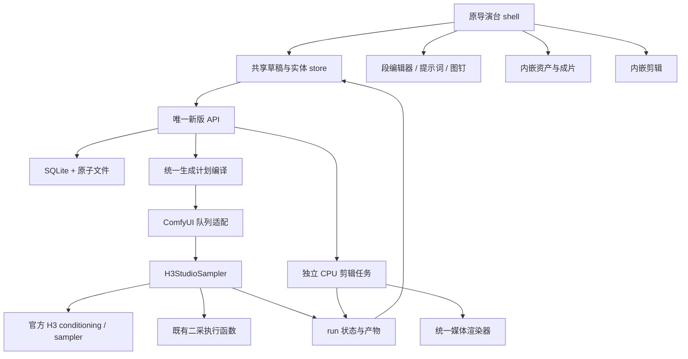

# 导演台内嵌改造与架构纠偏执行计划

日期：2026-09-07。审查基线：`50165b1` 加当前工作区未提交实现。

项目目录：`D:\jiaojie\ComfyUI-minimaxH3-SequenceForge`。

本文是下一轮实施依据，替代此前方案中“四个顶层 Studio 工作区”的产品设计。本文不表示产品功能已经完成。此次只审查和编写计划，没有修改产品代码。

## 0. 执行者先读

### 0.1 必须完成的结果

用户要的是在原导演台基础上改造。最终只能有一个主要导演台入口，打开的是原来全屏导演台的改造版。原来的三栏关系、逐段操作、总提示词入口、分段审片和底部生成操作继续存在。

新能力的位置已经确定：

| 能力 | 最终位置 |
| --- | --- |
| 统一生成方式 | 由当前段的参考和图钉推导，在段内显示摘要；取消互相排斥的文生/首尾帧/多参开关 |
| 素材、latent、成片 | 左栏的资产区域；可展开选择器，不跳出导演台 |
| 图钉 | 当前段卡片内的图钉条和展开编辑区 |
| 详细提示词 | 当前段卡片内的分组编辑器；总提示词在中栏展开 |
| 独立剪辑 | 同一导演台中栏的“剪辑”视图，沿用左资产栏和底栏 |
| 基础/改动/二采设置 | 右栏三个明确分组，删除“高级”“实验性”分类 |
| 任务进度和取消 | 原底栏固定位置，同时在对应段显示状态 |

“剪辑独立”指其数据、导出任务和执行器不依赖生成，不能再次解释成另造一套 Studio 页面。

### 0.2 已确定的边界

1. 可以使用新数据模型，不要求兼容旧工作流和旧项目格式；旧文件不得删除。当前新实现的数据若需改版，做一次有备份的确定性迁移，不清库了事。
2. 保留混合 H3 模型，按实际输入编译提示词和 conditioning；不强制分成 base/ref 两种模型，不自动切换模型。
3. 中文界面标签和含义，执行正文使用英文；台词、歌词和画面文字保留原语言。无付费 AI 服务，也不要求自动翻译。
4. 图钉覆盖首帧、尾帧、中间锚、续拍、已有段 latent、保存的 latent、图片、视频和音频。语义参考与固定帧锚定必须区分。
5. 剪辑范围：一条主画面轨、随画面原声、附加音频；导入、裁剪、分割、调序、图片停留、静音、音量、淡入淡出、预览和导出。不要扩成专业多轨特效系统。
6. 保留二采及已有必要控制，不把“简化设置”实现成只剩开关，或界面有开关而后台没有调用。
7. 不把未验证的 9/13 帧软保留、任意强度图钉、自动双向过渡当成可靠既有功能。续拍先建立可验证的官方 keyframe 基础。
8. 本轮不更换前端框架，不引入全套状态框架、微服务、外部消息队列、数据库服务或通用插件平台。

### 0.3 完成标准

每项能力必须形成完整链路：入口可以发现、控件可以操作、数据能够保存、预检可以解释、后台实际执行、结果回到原位置、失败和取消可恢复。只有 schema、按钮、HTTP 202 或 mock 测试通过，都不算完成。

每批只做第 11 节指定的工作。交接时列出修改文件、实际验证结果、未完成项，不能把代码注释写的功能作为完成证据。

## 1. 当前实现审查

### 1.1 审查范围与限制

已读取原导演台、新前端全部主要视图、新后端的数据/提示词/图钉/生成/剪辑/任务模块，以及本机 ComfyUI 的官方 H3 节点与单任务取消实现。已重新读取官方 H3 prompt skill 和两份格式指南。

已做本机只读接口检查：

- `GET http://127.0.0.1:8188/extensions` 同时列出旧 `h3_director.js` 和新 `h3_studio/entry.js`。
- `GET /h3chain/bootstrap` 返回新 schema v1，数据库摘要显示一个项目，未发现活跃任务。
- `GET /h3chain/projects` 返回 `{"ok":true,"projects":[]}`，是旧接口结构；新前端读取的是 `items`。

未生成视频、未取消用户任务、未运行真实 GPU 采样。窗口检查因 computer-use 无法确认浏览器 URL 而停止，没有获得界面截图；下文布局问题来自 DOM/CSS 和控制流证据，不冒充截图实测。实施阶段必须补做截图和真实媒体验收。

### 1.2 需要先处理的确定性问题

表中行号是本次审查基线的定位提示；编辑后用函数名重新定位。

| 编号 | 证据位置 | 当前问题与后果 |
| --- | --- | --- |
| F01 | `web/h3_studio/entry.js:101`；`web/h3_director.js:2672` | 新增独立侧栏和四个工作区，旧全屏导演台未接入新能力。产品入口发生分裂。 |
| F02 | `generation/view.js:45`；`editor/view.js:28` | 在侧栏内强行放 `220px 1fr 280px` 或 `240px 1fr 260px` 三列，没有相应收窄布局。仅两侧已占约 500px。 |
| F03 | `routes.py:182`；`h3_studio/routes/api.py:612` | 新旧同时注册 `GET /h3chain/projects`，返回形状不同。本机已复现新项目摘要存在、列表返回旧结构。 |
| F04 | `generation/view.js` 的 `renderRefBox(box, prompt, seg)` | 参数 `prompt` 遮蔽 `window.prompt`；“从资产库选择参考”调用 `prompt(...)` 会把对象当函数。 |
| F05 | `generation/view.js` 的 `renderTop()` | `const pid = projectId()` 得到字符串，复制和删除按钮又调用 `pid()`，会报 TypeError。 |
| F06 | `generation/view.js:169` 附近 `renderPins` | 新增图钉只有默认空来源和删除按钮，没有来源选择、位置、帧窗、注入方式等编辑器，无法完成配置。 |
| F07 | `generation/view.js:64`、`renderMid`、`debounceInput` | 草稿变化通知重建整个中栏；700ms 后销毁正在输入的 textarea，且存在重复通知。所谓增量渲染注释与实现不符。 |
| F08 | `generation/view.js` 的 `debounceInput/renderBottom`；`editor/view.js` | 输入只改内存，未自动调用持久化；底栏仍显示“已保存”。切换/刷新会丢草稿。 |
| F09 | `web/h3_studio/store.js:107`、`:173` | 列表摘要覆盖完整实体；保存响应直接替换草稿，响应回来前继续输入可能被覆盖。 |
| F10 | `h3_studio/projects.py:144` 附近 | 保存时按数组下标把新 segment_id 改回旧 ID。删除、插入和调序会让 ID 指向另一段内容，破坏图钉、结果、断点依赖。 |
| F11 | `studio_node.py:25`、`:213` | `from . import nodes as comfy_nodes` 指向插件自己的 nodes.py，后者没有导出的 `common_ksampler`；采样调用会找错模块。 |
| F12 | `studio_node.py:73`；官方 `nodes_minimax_h3.py:157` | 图片已是 `[N,H,W,C]`，又 `movedim(1,-1)` 后送 VAE，维度顺序错误；没有统一 resize/crop。 |
| F13 | `studio_node.py:_run_segment/_build_keyframes` | 以 `has_refs` 选择官方 Ref 节点，首尾强锚也被塞成普通 refs；生成计划和提示词 profile 不能保证一致。keyframe 落地只处理图片/部分 latent/上一段尾，视频、音频、任意段 latent 分支缺失。 |
| F14 | `h3_studio/generation/conditioning.py:136` | 图钉编译任何异常都变为空 keyframes；`compile_pins` 内的逐项 errors 也未被完整汇总进预检。用户以为用了图钉，实际可能没有。 |
| F15 | `routes/api.py:_validate_project_segments/compile_project`；`conditioning.py:126` | 提示词、图钉和运行时用不同默认时长；项目设置非 5 秒时可能出现末帧位置和预览时间不一致。 |
| F16 | `studio_node.py:_seed_for`；`generation/runner.py` | seed 只由段 ID 和 index 派生，没有使用界面 seed；review_mode、二采、质量策略等未进入真实采样编排。 |
| F17 | `routes/api.py:248` | latent extraction 只 reserve 一个任务然后返回 202，没有对应调度执行链路，不能把它当提取已实现。 |
| F18 | `jobs/monitor.js:29`；`generation/view.js:generate` | 全局 lastPromptId 不对应本次提交，失败后可能沿用旧 ID，并发时可能绑错任务；找第一个采样节点也不可靠。 |
| F19 | `generation/view.js:cancelRun`；`routes/api.py:552` | 前端 POST `/api/prompt` 发送 cancel 字段不符合本机取消 API，且不检查 HTTP 错误；插件端仅置内存标志，采样期没有读取它。 |
| F20 | `generation/status.py:cancel_run/update_run/is_cancelled` | 直接置 cancelled 后清除 Event，而 runner 只看 Event，存在已取消任务仍开始执行的风险；缺少状态比较的原子更新。 |
| F21 | `generation/view.js:68`；`jobs/monitor.js:119` | 终态后 `activeRunForOwner()` 返回空，底栏反而不重画；断线轮询只拿 active_runs，已经结束的 run 可能永远留在前端活跃表。 |
| F22 | `studio_node.py:311`；`h3_studio/renders.py:175` | 成片拼接从按时间倒序的成片库取段，且路径为相对路径；未依据本次执行的有序段结果组装。续跑还会遗漏此前完成段。 |
| F23 | `generation/runner.py:110` | 续跑读取 numpy latent，实际 `_tail_latent_slice` 使用 tensor `.clone()`；resume 参数也未从正式提交入口接通。 |
| F24 | `prompts/base_profile.py`；`reference_profile.py`；`compiler.py:467` | 基础首尾指令使用统一句式并放入正文，不符合官方不同模式的首行模板；Ref 风格放在 Shot 1 之后；summary 类型连接符、音景缺省等也不完整。 |
| F25 | `generation/view.js:renderShots/renderRefBox` | 没有屏幕文字编辑、完整声音身份/歌词/跨镜对白控制；Subject 来源靠手写，保留关系靠冒号拆字符串，修改时清掉 shots/note/assets。 |
| F26 | `editor/view.js:40`、`:295` | playheadUs 初始化后从未更新；分割无法定位；预览只播原素材，没有遵守裁剪和音轨混音，刷新资产又未统一写入实体表。 |
| F27 | `editor/view.js:179`；`editor/planner.py:76` | 前端将源音频长度按 48k 写入源样点字段，后端按源采样率解释。44.1k 素材会产生时长错误。 |
| F28 | `editor/planner.py`；`renderer.py:_item_chunk_gen` | `gain or 1.0` 把音量 0 还原成 1；自写分块线性重采样需校正边界连续性与重采样品质。 |
| F29 | `h3_studio/pins/resolver.py:69` | 无损切片仅对 token 边界吸附，未验证切片起始相位；单帧则完全不吸附，无法保证任意像素帧都对应一个可独立复用的 latent token。 |
| F30 | `entry.js:70`；各视图 `replaceChildren/destroy` | shell 订阅不回收；observer/timer/未完成请求生命周期不完整；进入/离开工作区后异步回写和内存增长风险。 |

另有验证缺口：现有 `_smoke_generation.py` 使用注入的假执行器，`_smoke_editor.py` 明确只测纯函数，不验证 PyAV 导出。它们不能证明 H3StudioSampler、真实取消、真实视频剪辑已可用。

### 1.3 本轮保留与替换

| 对象 | 处理决定 |
| --- | --- |
| `web/h3_director.js` | 保留入口、视觉骨架、段卡片组织及已有成熟交互；逐区替换数据源与内部编辑组件，禁止继续调用 syncMirrors |
| `web/h3_studio/entry.js` | 撤销独立 sidebar 注册和四工作区 shell；不再有第二个主入口 |
| `web/h3_studio/{api,store}.js` | 保留模块位置，修复契约和状态管理后供导演台共用 |
| `web/h3_studio/generation/view.js` | 拆出段编辑器和设置组件；不直接把整套 mountGeneration 塞到旧导演台里 |
| `web/h3_studio/assets/view.js` | 改成可嵌入资产浏览器，支持浏览/选择两种用途 |
| `web/h3_studio/editor/view.js` | 保留剪辑业务边界，重做嵌入布局、时间线交互、预览时钟和持久化 |
| `h3_studio/db.py/assets.py/projects.py/renders.py` | 保留 SQLite 和文件布局，补契约、事务、引用完整性和正确的列表查询 |
| `h3_studio/prompts/*/pins/*/generation/*` | 保留职责分工，按本文修正协议与实际执行能力 |
| `studio_node.py` | 保留 run_id 执行入口方向，修成真实可用的薄执行节点；前端不必显示 Studio 名称 |
| `upscale.py/upscale_net.py/grid.py/guides.py/media.py` | 审核复用既有算法，不能凭一个新模块名重新写一遍；media 合并逐步统一到剪辑渲染器 |
| `nodes.py/checkpoint.py` 的旧主链 | 作为续拍/审片/二采算法来源及旧入口留档，不让新版请求再串过两套完整调度器 |

内部 `h3_studio` 包名和 `output/h3_studio` 路径可以保留，改内部名字不能改善用户界面，不进行这类无意义搬迁。

## 2. 导演台最终布局

### 2.1 布局草图

以下是空间关系约束，不是要求执行者逐字显示的说明文字。

```text
原全屏导演台
+---------------------------------------------------------------------+
| 导演台  [当前项目 / 最近项目 v] [新建]    保存状态       [关闭]          |
+----------------+----------------------------------+-----------------+
| 当前项目摘要   | [生成 | 剪辑]       [总提示词]     | 官方基础设置    |
|                |                                  |                 |
| [素材|latent|  |  段 01  缩略图  时长  状态        | SequenceForge   |
|  成片]         |    英文正文摘要                    | 设置            |
| 搜索  上传     |    参考缩略图 / 图钉条             |                 |
| [图|视|音]     |    展开的当前段编辑器              | 二采设置        |
| 本项目/全部    |                                  |                 |
|                |  段 02  缩略图  时长  状态        |                 |
| 分页资产列表   |  段 03 ...                       |                 |
|                |  + 添加一段                      |                 |
+----------------+----------------------------------+-----------------+
| 当前段/阶段/步数/总进度       [取消任务] [继续/生成选中/生成]           |
+---------------------------------------------------------------------+
```

剪辑视图只替换中栏与右栏内容：中栏上方预览、下方时间线；右栏为片段属性和导出设置。左栏资产和成片保持选中状态。底栏切换成剪辑导出进度与导出按钮。顶部项目控件的下拉内可选择独立剪辑工程，后端不要求生成 project_id。

### 2.2 具体尺寸和响应式规则

- 大屏：左栏 240 至 280px，右栏 260 至 300px，中栏 `minmax(0,1fr)`；使用原 `.h3d-page/.h3d-stage` 的布局结构调整。
- 1280px 左右窗口：收起左栏项目摘要的长列表，保留当前项目一行；正文区域至少约 560px，不缩成两个窄文本框。
- 1050px 以下：资产和设置变成可打开的侧面抽屉，中栏占主宽；抽屉是同一组件的移动挂载或尺寸变化，不能另建一套 store。
- 窄窗口：每次只展开一个辅助抽屉；底栏按钮换行但不遮挡正文。字号使用固定档位，不按 viewport 缩放。
- 三栏各自滚动，输入区不因左栏加载或任务进度而跳动。卡片间不嵌套装饰卡片，分区用标题、留白和分隔线。
- 延用原导演台辨识度，统一文字、间距和边框；不做大标题营销页面。工具按钮用现有 ComfyUI 图标库，提供 tooltip 和可访问名称。

### 2.3 项目管理

新建仅需名称，可选空白项目/沿用当前基础设置。完成后直接出现一张空段卡。不要先展示大弹窗、全套参数、文件目录和模板设置。

最近项目放在顶栏下拉内，搜索、复制、重命名、删除放在项目菜单。左栏不再长期被全部项目卡片占满。项目名与内部目录/UUID 分离。

切换项目前自动刷新内存草稿并完成保存；保存失败时保留当前项目和草稿，提供重试或明确放弃，不能悄悄切走。删除按钮表示删除何种记录必须清楚，不能同时删除共享资产和既有输出文件。

### 2.4 原工作流动作归位

| 原动作 | 新位置与语义 |
| --- | --- |
| 新增、删除、拖拽调序 | 原段卡片列表；使用稳定 segment_id，不靠 index 当身份 |
| 不上链 | 段头启用开关；禁用段不执行，依赖指向最近启用的上游段 |
| 独立镜头 | 段头接续开关；关闭自动续拍，保留显式用户图钉 |
| 重摇 | 段操作菜单；先展示会影响哪些依赖段，种子变化记录到运行快照 |
| 逐段确认/继续 | 底栏主按钮；每次只提交下一个未确认段的运行计划 |
| 重新二采此段 | 已完成段操作菜单；仅失效该段二采产物 |
| 插入外部视频 | “加入剪辑”用于成片排布；“从该视频继续”用于图钉，不混成同一按钮 |
| 合并导出 | 成为“加入剪辑”的快捷操作，始终可打开剪辑，不受 done、lastDir、manifest 限制 |
| 总提示词 | 中栏内展开的批量编辑视图，可扩展宽度；不是再弹一层巨型模态框 |

## 3. 模块关系与数据契约

### 3.1 保持小而明确的架构



图中每个框是职责，不要求额外引入类、服务进程或新的框架。

### 3.2 API 命名与响应

新版统一前缀固定为 `/h3chain/v2`。在现行 ComfyUI 需要时注册对应 `/api/h3chain/v2`，前端通过当前 ComfyUI 的 `api.fetchApi` 适配前缀。旧 `/h3chain/*` 留给旧节点，不重复占用同一个 method + path。

前端 API 模块是唯一构造 URL 和解释错误的地方，上传也遵守相同前缀。不要让各组件直接 fetch、猜测备用地址或重复提交写请求。

保留既有 assets/projects/edits/runs/renders 资源形式；补以下必要能力：

| 接口 | 作用与返回要求 |
| --- | --- |
| `GET /bootstrap` | schema、能力、当前选择和活跃任务摘要；不每次扫描大模型目录 |
| `GET /projects`、`GET /edits` | 固定 `{items,total,page,size}`；items 只有摘要，不能覆盖详细草稿 |
| `PATCH /projects/{id}`、`PATCH /edits/{id}` | `{base_revision,client_mutation_id,document}` 或保留各自已有正文键，统一选一种并写 contract 测试 |
| `POST /projects/{id}/compile` | 传 revision 和可选 segment_ids；返回 effective_frames、提示词、标签、图钉解析及定位到字段的诊断 |
| `POST /pins/resolve` | 只读解析一个来源窗口，返回请求区间、实际区间、相位、是否重编码，不启动 GPU |
| `POST /projects/{id}/runs` | 冻结计划和依赖，返回 run_id；只接受明确的 scope/seed/resume 选择 |
| `POST /runs/{id}/bind` | 若保留两阶段提交，绑定指定的本次 prompt_id，幂等并允许执行先于 bind 的竞态 |
| `POST /runs/{id}/cancel` | 唯一取消入口，后台决定队列删除、原子中断或剪辑协作取消 |
| `GET /runs/{id}` | 默认状态摘要；request/report 用 `include` 按需加载，避免进度刷新重复传整个项目 |
| `POST /assets/{id}/latent-extractions` | 真正创建并提交需要 VAE 的任务，不能只 reserve；不满足 VAE 条件时提交前报能力错误 |
| `POST /renders/{id}/as-asset` | 幂等转成可被图钉/剪辑引用的 video 资产，避免下载再上传 |
| `POST /edits/{id}/exports` | 无需 H3 节点，202 + run_id；结果登记成片 |

状态码区分格式错误 400、找不到 404、版本冲突 409、业务预检失败 422。返回的业务错误至少有 `code,message,field_path,segment_id/pin_id/clip_id`；不能只 toast “校验失败”。

### 3.3 稳定身份与权威来源

- `segment_id/shot_id/pin_id/subject_id/reference_id/clip_id` 是稳定身份；index 和标签编号是展示顺序。移动内容不改变 ID。
- 项目默认设置只在解析 effective settings 时继承，schema 清洗不能按数组位置重建身份，也不能静默截断超限记录或文本。
- 项目正文和剪辑正文以 SQLite 中成功提交的 data + revision 为权威。JSON 备份文件是可重建快照；不可出现文件成功、数据库失败后下次读取来源不明的情况。
- 更新使用事务内版本条件：`UPDATE ... WHERE id=? AND revision=?`，检查影响行数；普通的先 SELECT 再无条件 UPDATE 不构成可靠乐观锁。
- asset 文件入库后内容不变；引用保存 asset_id + content_hash。名称、标签可改，不改变媒体身份。
- 成片是带出处的产物记录；作为后续输入时创建资产记录并保护引用。删除成片索引不能破坏已经引用它的资产。
- 编辑工程允许 `generation_project_id=null`；关联生成项目只是便利，不作为导出前置条件。

### 3.4 前端草稿保存

store 至少区分 `projectSummaries`、`projectDocuments`、`editSummaries`、`editDocuments`；草稿记录包括服务器 revision、localVersion、dirty、saving、error。列表刷新不替换正文。

保存算法按以下顺序实现：

1. 每次输入立即写本地草稿，保持当前 input DOM、光标和 IME 状态。
2. 700ms 防抖的是持久化，不是输入值入内存。compositionend 后再触发保存。
3. 按 document_id 串行保存，记录提交时 localVersion；保存期间继续编辑只标记下一次保存。
4. 收到响应只确认对应版本；如果本地有更新，不能用旧响应整体覆盖草稿。更新 server revision 后继续保存下一版。
5. 生成、编译、切换项目、关闭编辑视图前调用统一 `flushDraft(document_id)`，等待成功。
6. 409 保留双方版本并展示“另一个窗口已修改”，提供重新载入或把当前草稿保存为副本；不自动覆盖服务器。
7. “已保存”只在无 dirty、无保存请求、无错误时显示。页面刷新可通过轻量本地草稿恢复保护尚未提交的编辑，但不保存媒体或 latent 到浏览器存储。
8. 组件 destroy 取消定时器和过期请求；不会取消已经确认提交的后端任务。

### 3.5 统一运行快照

一个 run 固定保存：项目 revision、scope、实际节点 ID、模型/CLIP/VAE 身份、各段有效尺寸与帧数、实际 seed、PromptDocument、PresentationPlan、ResolvedPins、续拍依赖、二采设置、输出顺序。

同一个 `compile_generation_plan()` 用于预检、预览和 reserve。运行时补充需要真实 VAE 的身份校验，不另算另一套默认帧数。未解决的依赖必须显式保留为 typed deferred 项，不能变成空列表。

完整快照只在预留时写一次。进度事件只传增量状态；列表只查询摘要。产物按 run_id + segment_id + attempt_id 记录，禁止按“最近文件”猜当前结果。

## 4. 提示词系统完整规格

### 4.1 官方来源

- Skill：<https://github.com/MiniMax-AI/MiniMax-H3/tree/main/skills/h3-prompt-writing>
- 基础格式：<https://raw.githubusercontent.com/MiniMax-AI/MiniMax-H3/main/skills/h3-prompt-writing/references/base-en.txt>
- 多参格式：<https://raw.githubusercontent.com/MiniMax-AI/MiniMax-H3/main/skills/h3-prompt-writing/references/ref-en.txt>

实施时保存三份官方文本到 `docs/official_h3/` 并记录获取日期、URL、内容 SHA256；固定样例测试使用这份快照。不要用仓库社区 expander 的字数、摘要或语言规则覆盖官方格式。此处所说“完整”是覆盖官方描述语义，不是把辅助编辑字段都变成发给模型的新标题。

### 4.2 编辑区组织

段卡片默认显示英文正文摘要、时长、参考缩略图和图钉摘要。展开后显示以下分组，按内容需要展开；不能把所有字段同时堆成几十个窄 textarea。

1. 场景与画面。
2. 镜头与动作。
3. 角色与发声。
4. 画面文字。
5. 场内声音与配乐。
6. 参考定义与保留方式。
7. 官方执行文本。

每个英文输入旁有简短中文含义和可按需查看的英文例子；解释应与当前字段直接相关。原导演台的场景/角色/音景/配乐分段交互扩展为这些分组，布局仍属于当前段。

### 4.3 必须有编辑入口的字段清单

| 分组 | 中文含义/输入 | 编译位置及约束 |
| --- | --- | --- |
| 场景 | 媒介与整体风格 | Base 在 `[Shot 1]` 后；Ref 的 detailed_description 在 `[Shot 1]` 前先写 1 至 2 句 |
| 场景 | 初始构图、景别、主体画面位置 | 当前 Shot 的具体视觉描述 |
| 场景 | 整体背景、空间关系、时间/天气 | 英文可见环境，不是抽象剧情梗概 |
| 场景 | 光照方向、颜色与调色 | 对应镜头，允许逐镜覆盖 |
| 场景 | 角色外观、服装、年龄特征、姿态 | 身份特征和当前可见状态分别可写 |
| 场景 | 道具、物体、界面、状态变化 | 既包括初态，也能在动作段描述变化 |
| 镜头 | Shot 列表、切镜时刻、切镜关系 | Shot 1 无时间戳；后续 `[Shot N] At MM:SS.mmm`；严格递增 |
| 镜头 | 动作、反应、因果、先后顺序、结束状态 | 英文主体段落，可完整自由编辑，不限制成几个标签 |
| 镜头 | 运镜类型、幅度、速度、补充描述 | 使用官方词表生成自然英文句；允许复杂运镜写入正文，不能硬性规定每镜只有一种动作 |
| 镜头 | 参考在本镜出现/生效的位置 | 引用稳定 ID，展示 `<Subject/Picture/Video/Audio N>`，编译时插入明确关系 |
| 角色声音 | 声源身份、对应角色、是否可见、音高、音色、语速、口音 | 第一次实际发声建立身份；人物 ID 与 `(Sx)` 分开 |
| 角色声音 | 对话/唱词、语言、说/唱/旁白、语气与动作 | `<d>[Language] 原文</d>`；身份/动作/语气在标签外 |
| 角色声音 | 多人同时发声 | 支持多个既有 speaker_id，输出 `(S1,S2)`；不能强制变成一个人 |
| 角色声音 | 画外旁白 | 使用 `says in an off-screen voiceover`；对对应在画人物按官方要求紧接闭唇描述，不能给无人物的声音凭空造嘴唇 |
| 角色声音 | 跨切镜延续、结尾截断 | `<scenetrans>`、`<cutoff>` 和跨镜持续描述；完整原文仍保留 |
| 角色声音 | 复用音轨内的歌词/话语线索 | 引用 `<Audio N>`，没有独立发声人物时不虚构 `(Sx)` |
| 画面文字 | 原文、类型、承载物、画面位置、出现镜头/阶段 | 招牌/字幕/横幅/标签等；英文双引号包住原文，不能自动翻译或擅自加字幕 |
| 场内声音 | 同步动作音、非语言人声、声源与时机 | 放在当前 Shot 正文中 |
| 场内声音 | 角色能听到的音乐、乐器/收音机/手机等来源 | diegetic_music 是编辑辅助字段，实际编入描述正文 |
| 音景 | 环境声、物理动作声、非语言声的整体归纳 | `overall_soundscape`，1 至 4 句一段，不重复完整对白、唱词和场内音乐 |
| 配乐 | 观众听到、角色听不到的配乐 | `non_diegetic_music`，乐器、速度、节奏、动态和淡入淡出；无配乐 `N/A` |
| 声音状态 | 完全静音 / 自行描述 / 尚未填写 | 只有明确完全静音才输出音景 `N/A`；未填写显示待完善，不静默省略官方字段 |
| 参考 | Subject 定义及其素材来源 | 一主体可来自多素材，一素材可定义多主体；Subject 不是额外媒体输入 |
| 参考 | Picture/Video/Audio 的实际用途 | 具体帧锚、视频节奏/延续/编辑源、音色参考或音频复用，分清输入类型与使用意图 |
| 参考 | summary | 类型集合 + 英文一段摘要；用户直接可编辑 |
| 参考 | retention | 每个独立跟踪内容的来源、适用 Shot、保留关系、保留/改变内容、理由；不再用一行冒号文本当数据结构 |

可给结构化事件增加稳定 event_id 和可选时间区间，供编译、声音顺序和预览定位使用。只在需要明确时间时要求用户填写，不把每个动作都强迫变成精确帧脚本。

### 4.4 Base 与 Ref 输出规则

Base 的字段顺序固定为 `integrated_multimodal_description`、`overall_soundscape`、`non_diegetic_music`。I2VA、FL2VA、L2VA 在这些字段之前加官方对应的独立首行，之后空一行。

- I2VA 使用官方 `For the target video, at 0.00 seconds...` 首行。
- FL2VA 使用官方 `How the reference pictures align...` 双图句式，不拼成两条 I2VA 句子。
- L2VA 使用官方 `How the reference pictures align...` 尾图句式；Shot N 是真正末镜。
- 文本的末帧时间使用 effective duration 两位小数；tensor 锚点使用 `effective_frames - 1`。duration 与最后一个像素帧的起始时间是不同字段，不混用。
- 只有 latent、没有进入文本编码器的图片不分配虚假的 `<Picture N>`。latent 单独作为时序条件，其用途仍在中文图钉界面可见。

Ref 顺序固定为 `subject_definitions`、`summary`、`retention_analysis`、`detailed_description`、`overall_soundscape`、`non_diegetic_music`。媒介风格出现在 detailed_description 的 Shot 1 之前。官方指南建议生成任务的详细描述通常约 350 至 500 个英文词，作为写作建议，不作机械字数阻塞，也不能保留社区 50 至 120 词硬上限。

summary 类型限定为官方含义：`keyframe completion`、`reference generation`、`video editing`、`video continuation`、`audio reuse`、`audio reference`。组合用 ` + `，按实际用途推导，用户可修正；不使用 `audio copying` 等自造类型。

### 4.5 参考编号与保留关系

生成统一 PresentationPlan，固定实际送入编码器的顺序后才分配标签。Picture、Video、Audio、Subject 各自编号；数据库保存 ID，文本展示才使用编号。

普通图片用于抽象角色/环境时，允许仅在 Subject 定义中引用其 Picture 来源，不强迫每张源图片都有独立定义行及 retention 行。只有需独立跟踪其帧锚或内容用途时单列。

视频文件有音轨不等于自动参与声音参考。声音启用后才分配 Audio 标签，音轨与视频来源关系在 PresentationPlan 保留。必须适配官方节点实际的输入顺序，不能独立排列文本标签而不重排底层引用。

视觉保留菜单：`fully_preserved / partially_preserved / attribute_transfer / weak_reference`。

音频保留菜单：`fully_copy / partially_copy / reference / weak_reference`。`fully_copy` 指完整源音轨成为完整最终音轨；仅复制配乐并叠加其他声音不符合该含义。模型的“音频复用”提示不代表字节级复制承诺，要求真实原声复制时走剪辑的确定性混音。

实际发声顺序决定 `(S1)`、`(S2)`，与 Subject 编号无关。更改声音事件顺序会重新生成展示编号，但保持 speaker_id 与人物对应。retention 中不放 `(Sx)`。

### 4.6 双编辑方式与总提示词

每段明确选择 `structured` 或 `official_text` 编辑方式：

- structured：上述分组字段是权威，编译后的官方文本可预览和复制。
- official_text：最终执行文本是权威，可按官方顶层字段分区编辑，也可展开全文。分区修改必须作用于同一份 raw_text 的对应区间，不再维护另一套不同步的字符串。
- 从 structured 进入 official_text，先 flush 并编译，然后保存完整文本和结构化备份。切回时恢复结构化备份，保留手工文本历史，不假装能把任意英语可靠拆回场景/角色字段。
- official_text 的正文不被自动摘要/自动润色覆盖。必须保留合法首行、空行、台词和用户措辞；解析器只识别已知顶层字段、指令和引用，不以 serialize 再生成的方式吃掉首行。
- 模式必须是独立枚举，不能用 `override_text` 是否为空字符串决定当前模式。

总提示词入口在中栏展示全段目录和对应官方文本。先实现全段浏览、复制、选中段编辑；批量导入使用带 `schema_version`、稳定 segment_id、editor_mode、raw_text 或 structured 正文的 JSON 包。任意长文本先进入导入预览，明确匹配哪些段再应用，不猜分段后立即覆盖全部项目。

应用批量修改形成一次可撤回的本地修改；保存后的批次保留一个 revision。窗口中直接选资产不会清空提示词；删除被引用素材时定位受影响字段，要求修正后再运行。

### 4.7 校验等级

阻止提交：未知/失效引用、重复身份、错误官方字段顺序、非法时间、对话标签不配对、图钉缺来源、执行条件不支持。允许保存未完成草稿，但显式标记未就绪。

仅提示建议：过于概括、信息缺失、参考实际作用写得不清楚、建议字数未达到。没有 AI 时只能做可解释的规则检查，不能声称已经验证了全部语义或英文质量。

## 5. 统一图钉与 latent 规格

### 5.1 图钉界面

资产项可选择“用作参考”“用作图钉”“加入剪辑”。拖到段内也先选择用途，不因文件类型擅自强制改模式。

图钉编辑区包含：来源缩略图与名称、来源类型、来源片段/帧窗、目标位置（首/尾/指定帧）、目标作用段、注入方式、是否带声音、请求区间/实际区间、冲突与兼容性结果、启用开关、删除。

保存 latent 的入口至少存在于已完成段操作菜单、视频/图片资产详情。选区支持时间标尺和数值输入；合法帧数菜单显示 1、5、22、39、56 等，不能让用户填写 token 公式。

在一个缩略图上显示“画面锚”“语义参考”“含声音”等准确状态。不要显示未经实现的可调图钉 strength 滑杆。

### 5.2 数据形状

保留现有 Pin 基本形状，至少修正为以下含义：

```json
{
  "pin_id": "stable-id",
  "enabled": true,
  "source": {
    "kind": "asset",
    "asset_id": "asset-id",
    "segment_id": null,
    "run_id": null,
    "artifact_id": null
  },
  "target": {"segment_id": "target-id", "position": "frame", "frame_index": 48},
  "injection": "latent_only",
  "selection": {
    "type": "clip",
    "source_start_frame": 17,
    "requested_frames": 22,
    "policy": "lossless_snap"
  },
  "include_audio": false
}
```

这是请求值。actual_start、actual_frames、token_start/end、source phase、target interval、source PTS、crop policy、audio interval、需要重编码等放在后端 ResolvedPin，不相信前端自行填写的 actual 数值。

source.kind 支持 asset、previous_segment、segment_latent。previous_segment 必须在运行计划冻结为真实依赖段；segment_latent 选择确定的已完成 artifact，不能只写一个可能对应多次生成的 segment_id。

### 5.3 注入能力矩阵

| 来源 | 语义参考 | 画面/时序图钉 | 声音锚 | 处理方式 |
| --- | --- | --- | --- | --- |
| 图片 | 支持 | 单帧 | 无 | latent_only 或 latent_and_text；统一尺寸适配后 VAE 编码 |
| 视频 | 支持 | 合法帧窗 | 可选 | 按源时间取窗、匹配 H3 fps，编码一次；语义参考与画面锚可以并用 |
| 音频 | 支持音色/节奏等 | 无 | 支持 | 区分文本意图上的 reference/reuse 与实际音频 latent 锚 |
| 已保存 latent | 没有可用原图时不支持视觉文本输入 | 支持兼容切片 | 有音频 latent 时支持 | 校验 VAE、分辨率、时间布局等；需要原图的强参考必须有确定来源图 |
| 上一段/指定段 latent | 以对应真实画面资产为前提 | 支持 | 有对应音频才支持 | 从已确认产物读取，按依赖图执行 |

对于本机官方 API 尚未支持或本轮执行器未接完的组合，能力响应必须 false，界面说明具体缺口。最终交付前用户要求的组合必须接通，不能用永久禁用代替完成。

### 5.4 帧数、token 相位与来源时间

至少区分四个域：源媒体 PTS/秒、源像素帧索引、源 latent token、目标生成像素帧。不能把一个 frames_to_latent_t 用到所有域。

官方像素帧跨度周期是 `(1,4,4,4,4)`。设 token 起点累计函数 `F(t)=sum(FRAME_PER_TOKEN[k mod 5], k=0..t-1)`，一个原生切片 `[a,b)` 的源覆盖长度是 `F(b)-F(a)`。keyframe 本身重新从本地 token 0 布局，其解释长度是 `F(b-a)`。两者只有满足相位与区间协议时才可等价复用。

因此必须实现并测试：

1. 合法 guide 长度为单帧 1，或 `5+17k`；这是长度规则，不证明任意起点可无损切片。
2. lossless_snap 使用兼容的 token 起点和终点，验证原始跨度与注入解释的时间布局一致。起点相位 0 是应首先验证的候选，不把所有 token 边界视为等价。
3. 单帧请求若位于一个覆盖多像素帧的 token 内，不能宣布得到那一张精确帧的原生 latent。显示实际吸附结果，或选择 exact_reencode。
4. exact_reencode 解码并按用户请求裁剪，再明确补齐/取样到合法长度，重新编码并标记 reencoded；不要把重编码称作无损。
5. 帧窗超过源或目标容量时，返回明确解析结果；禁止悄悄越界后切到空 tensor。目标 `end` 对多帧窗表示窗口结束贴尾，实际起点为 `target_frames-window_frames`，不能把整个窗放到最后一帧之后。
6. 源视频非 24fps 或 VFR 时先通过 PTS 选区，再按目标 H3 的采样时间生成窗口；不把源帧数直接当 24fps 时长。
7. 音频根据同一实际时间窗裁剪，并按官方 `FRAME_RESCALE` 等参数转换音频 latent 区间；不能对音频套视频 token 公式。

用本机 `comfy_extras/nodes_minimax_h3.py:MiniMaxH3AddGuide` 和 `comfy/ldm/minimax/model.py` 验证 shape、相位解释与官方 keyframe 字段。无需、也不得修改 ComfyUI 核心来掩盖不兼容。

### 5.5 冲突与依赖

冲突按实际目标区间判断，不只比较起点。显式视频图钉互相重叠且来源不一致时阻止运行，给出冲突两项；同一来源同一区间可去重。视频与音频不同通道可同位存在。

用户图钉与自动续拍相撞时，UI 明确展示自动图钉被覆盖；只取消真正冲突的自动部分，不暗改用户输入。自动续拍头锚与不重叠尾锚可并存。

长程一致性优先实现为固定语义参考，或用户明确指定的非冲突 keyframe。不要把首段记忆和上一段续拍都硬塞在 frame 0，再用假 strength 声称是软参考。

依赖计算基于稳定 ID 和启用状态，检查环、缺失来源和未来段依赖。修改某段使依赖它的基础结果失效；独立镜头切断自动续拍依赖，但保留显式跨段图钉依赖。

### 5.6 latent 存储

使用 safetensors，meta 至少含：格式版本、tensor 名称/shape/dtype、视频和音频 VAE 身份、H3 时间网格版本、源尺寸/帧数/fps、实际窗口、起始相位、音频采样信息、项目/段/run/artifact 出处、reencoded、父资产。

不要用空 VAE 指纹绕过检查。未知身份可入库供管理，运行前必须证明兼容或显式重编码。不要仅用 Python 类名作为 VAE 内容指纹，也不要在每个图钉处重新读几 GB 权重计算 hash。

生成断点与用户收藏 latent 是不同用途：断点按运行保存；“保存到 latent 库”创建可引用资产。去重允许复用同一不可变文件，不需每次复制。dtype 写入不能强制对所有 torch tensor 调 `.numpy()`，需验证 bf16/fp16 的实际保存与加载路径。

## 6. 生成、续拍和二采

### 6.1 统一 conditioning 执行

修正 `studio_node.py` 的官方模块导入，使用 ComfyUI 的 `nodes.common_ksampler`。随后以真实官方 API 检查输入/输出，不以 stub 导入成功作为验收。

执行器接收编译好的 plan：

1. 解析实际资产并校验内容身份；失效/缺失时返回定位错误。
2. 以 PresentationPlan 构造文本编码器输入及 Ref blocks。基础首尾强锚沿用官方 I2VA 路径的行为；混合输入按 ref profile + keyframes 组装。
3. 图片统一 `[N,H,W,C]`，沿用官方 resize/crop；无依据不转维度。只给 latent 的图不进入文本编码器。
4. 视频/音频 guide 调用官方 AddGuide 或经过同等契约验证的封装；原生 latent 通过 `guides.py` 统一构造，不在多个文件手抄协议。
5. 在保留已有 conditioning 元数据前提下合并 keyframes。冲突、shape、VAE 不匹配直接失败，禁止 except 后空条件继续采样。
6. 采样、必要二采、解码、裁桥、编码、登记产物。每阶段有取消检查、错误归属和实际参数记录。

一个仅首帧 latent_and_text 的段不能因为 has_refs 就盲选 Ref API；混合模型不等于两种 conditioning 可以任意互换。

### 6.2 种子、审片、重跑和依赖

seed 以十进制字符串跨 JSON 保存，避免 JS Number 超过 2^53 的精度丢失。首次生成按项目 seed 与稳定规则生成各段 seed，并冻结到 run；恢复沿用实际 seed，重摇显式变更，UI 显示实际值。

每段状态分离：草稿就绪、已排队、运行中、已完成、待确认、失败、取消、因上游变化而过期。项目文档 revision 不等同于基础生成 fingerprint，改标题不使视频失效。

逐段审片只生成目标段并结束当前 Comfy 任务，完成后回到导演台等待用户继续，不占着 GPU 等确认。一次性生成则执行计划中的全部目标段。

恢复入口传明确 `resume_from_run_id` 和需要沿用的 artifact ID，不只传一个 skip_until。校验这些产物的 prompt、seed、参考、图钉、模型、尺寸和依赖指纹。加载到适当 tensor dtype/device 后再注入，不能把 numpy 直接传入 tensor 方法。

### 6.3 续拍和可见时长

自动续拍是一条可见的系统图钉，默认窗口先采用经验证的 22 帧候选，允许用户选 1/5/22/39 等；最终默认需真实片段验证，不能仅靠数学单测证明效果。

运行计划必须分别记录：请求新增时长、采样总帧数、头部桥帧数、实际保留区间、有效新增帧数、输出时长。上一段桥覆盖的是已经输出过的内容，下一段成片不得重复播放它。

尾帧/中间图钉的目标位置以用户看到的有效片段为参照，编译器统一转换到包含桥的采样域；若选择按采样域查看，必须明确标注。音频裁剪与画面裁桥在同一个计划中计算。

第一轮取消未验证的自动接缝重采、双向过渡、软强度等执行分支，旧文件留存。完整交付以可靠的关键帧注入、音画桥、有效区间裁切为基础。需要重新启用某质量处理，必须单独有触发逻辑、成本上限、取消点和对照样片，不因“改架构顺便优化”自动加上。

### 6.4 二采必须实际连通

保留 `upscale.py:render_latent/render_segment` 和 `upscale_net.py` 已有设备/精度/分块修复，写一个项目设置到既有 cfg 的显式适配器。审查 render_latent 对已有 guides 的放大和重建，统一图钉不能在二采中消失。

每段至少区分 base_latent/base_render 和 upscale_latent/upscale_render 的身份。改二采设置只失效二采指纹；单段重新二采不能重新生成其他段。默认成片选择已生效的高清版本，保留可追溯的基础产物记录。

二采可跟随生成或对选中段单独提交 GPU run；必须经过同一个 Comfy 队列，不在 HTTP 线程偷偷加载模型。VAE 和 upscaler 无法满足时生成前预检。

### 6.5 成片装配

生成的自动成片和用户剪辑导出使用统一 RenderPlan/渲染器。自动成片的输入是执行计划中的有序有效段 artifact，不查询“最新 N 条成片”推断顺序。

必须纳入恢复沿用段、用户确认版本与明确加入的片段。每段使用有效裁剪范围。路径经过存储根解析，不把相对 path 当当前工作目录路径。失败不写成功 final 记录，也不吞掉错误只在报告里加一句。

## 7. 三组设置和任务状态

### 7.1 设置映射

| 组 | 正常显示 | 条件显示/内部处理 |
| --- | --- | --- |
| 官方 ComfyUI 基础设置 | 模型连接摘要、画幅/尺寸、时长、seed、steps、CFG、sampler、scheduler | 原节点链已有的官方 sigma shift 在确实接入时显示；不重复应用，保存到运行快照 |
| SequenceForge 设置 | 审片方式、默认续拍窗口、声音接续、自动成片、MP4 质量 | 当前段独立镜头/图钉放段内；未验证的质量实验不显示为正式功能 |
| 二采设置 | 开关、执行范围、放大模型、目标方式和目标值、重采样强度/步数、必要轮数、编码质量 | 精度、设备、分块按检测到的能力自动选择；手动 override 如确有必要仍放本组，按需展开具体项，不复活“高级设置” |

尺寸只能有一种有效输入源：比例+面积算尺寸，或自定义宽高；不能两个互不联动的值同时看似生效。sampler/scheduler 来源为本机能力列表，不凭空给固定不支持的选项。

二采目标选择 size 时显示宽高，megapixels 时显示面积，scale 时显示倍率；选择 selected 时提供真正的段选择。必要的 temporal chunk、释放策略、可用精度保留在实现中，不丢掉已经修复的 CPU/GPU 设备行为。

给每个可见控件建立映射表：UI path -> schema path -> plan 字段 -> 执行函数参数 -> 输出证据。找不到最后一项的控件不能宣称可用。

### 7.2 提交与任务绑定

不要 monkey-patch 全局 api.queuePrompt 来记录 lastPromptId。设置专用 queue adapter：

1. flush 当前草稿，获得准确 revision。
2. 找到用户明确绑定的采样节点及其模型/VAE 输入，缺失则在 reserve 前定位问题；多个节点时选择并记住 node_id。
3. 用当前 ComfyUI 支持的图序列化流程得到 API prompt 的副本，在副本中注入 run_id；不通过隐藏 LoadImage 等节点承载资产。
4. 调用官方 `api.queuePrompt` 并接收这一次调用的 prompt_id；不能假定 `app.queuePrompt()` 有同样返回值。
5. 队列适配器必须经过真实画布 hooks/动态 widget/subgraph 序列化检查，不要为了拿 ID 绕掉必须的图处理。必要时使用经验证的调用级关联机制，不能退回全局最近 ID。
6. bind 验证执行图中指定节点的 run_id，与本次 run 对应；绑定允许快速执行先结束再收到响应的顺序，不修改终态。明确重试和响应丢失后的查询恢复。
7. 重复点击只产生一次提交；queue 失败/图校验失败使保留的 run 进入失败并显示原因，不能弹“已提交”后留 reserved。

若实现难以用纯前端保证 bind，可以把队列提交归属处理封装到插件后端，但只能有一个提交实现，并继续走 ComfyUI 正式执行队列。选择具体方式后写适配层契约测试，不让每个按钮自己实现。

### 7.3 取消语义

插件 `POST /runs/{id}/cancel` 是前端唯一入口。

- reserved/validating：停止后续提交，终态 cancelled。
- queued：精确从队列删除对应 prompt_id，再确认状态；禁止只改数据库不删队列。
- running generation/upscale/extraction：使用本机经过验证的单任务取消能力，其内部需原子比较 running prompt ID。当前本机官方接口为 `/api/jobs/{job_id}/cancel`，`server.py` 使用 `interrupt_if_running`。
- 旧版本缺该能力时，只能精确取消队列和以 runner 的协作检查点取消本 run，并向用户显示等待检查点；不能“查当前是谁，再发全局 /interrupt”，该方式有误伤竞态。
- edit_export：置任务取消标志，解码、编码和混音的有界块内检查；保留已完成成片，清理未完成的 `.part`。
- 取消中禁用重复点击，已完成后再取消幂等返回真实终态。中断异常被分类为 cancelled，不混成普通 failed。
- runner 进入任何耗时阶段前检查数据库 state 和 cancel 标志；terminal 不能因 Event 被释放而重新变成可执行。

### 7.4 同步与恢复

run 状态事件至少包含 run_id、owner_id、prompt_id、state、stage、current_segment、total_segments、stage_progress、progress、monotonic state_version。数据库按版本条件更新，前端丢弃旧版本事件。

正式终态只有 succeeded/failed/cancelled；cancelling 是等待执行器确认。stage 不明确进度时用不定进度，不展示伪造百分比。步数和段数可同时显示。

只接受属于该 prompt_id/node_id/run_id 的事件。缺 prompt_id 的 Comfy 事件不能直接改变本 run 状态；可触发轻量查询核对。图在采样节点之前失败、被外部取消或执行缓存命中时，后端状态协调器必须基于队列/历史归档收尾，不能依赖浏览器在线才能完成。

WS 正常时使用事件；连接恢复立即对已知活跃 run 逐个取摘要，再补服务器 active 列表。断线时按已知 ID 每 2 秒有界轮询，终态也能被取到；不靠“活跃列表没它”就判断成功。空闲和页面隐藏停 UI 轮询，恢复可见时一次 reconcile。

服务启动只执行一次 interrupted run 恢复。客户端切回项目可获取最后一次 run 的终态与产物；任务不因为关闭导演台而中断。资产/成片事件实际更新缓存或使相应页失效，不只是注册监听后忽略。

## 8. 内嵌独立剪辑的完整规格

### 8.1 不依赖生成的入口

导演台在画布没有 H3 节点时仍可打开，默认提供资产浏览和空白剪辑。仅“生成”和需要 VAE 的 latent 提取要求相应节点/能力。剪辑工程由 edit_id 标识，创建时不调用生成项目接口。

原合并入口改为选择已完成段/成片后“加入剪辑”。进入的是同一导演台的剪辑视图，立即出现选中的片段，排序遵循用户选择/排布顺序。外部文件可在全新剪辑中直接上传和加入。

编辑只改变 EditDocument，不改生成 project、不触发 H3 重跑。生成段更新后，现有剪辑仍指向原 artifact，用户可主动“替换为新版本”，不静默改变已经编好的作品。

### 8.2 时间单位统一

前端显示秒、`HH:MM:SS.mmm` 或帧号，不向普通用户显示微秒和样点。

为降低本轮实现错误，把新版 EditDocument 的来源入点/出点、时间线起点和淡入淡出统一存整数微秒；图片停留保留输出帧数。生成 H3 帧数网格不约束普通剪辑片长。

RenderPlan 内部才换算到输出视频帧和 48k 音频样点。每个音频 item 保存源采样率，不把 source sample 和 timeline sample 混用。现有 v1 音频字段迁移时按“源样点除源采样率”“时间线样点除 48000”分别换算，写出迁移测试。

片段排序只用数组顺序或统一 order，二者只能有一个权威。分割必须满足 `clipStart < playhead < clipEnd`，保留左右片长度守恒；当前实现仅检查 cut>0 不够。图片分割按输出帧边界，音频独立片段也能裁剪、复制、删除，不能把音频复制进 video_track。

### 8.3 必须有的操作

| 操作 | 精确行为 |
| --- | --- |
| 导入 | 图片/视频进入主轨，音频进入附加轨；素材库能分页搜索，不限前 40 个 |
| 选择片段 | 稳定 clip_id；右栏显示对应属性，不重建播放器 |
| 拖动排序 | 主轨连续排列，拖动中本地更新；松手形成一次草稿修改并保存 |
| 裁剪 | 入点/出点数值与拖动边界一致，受真实源时长约束 |
| 分割 | 时间标尺点击或播放推进更新 playhead；在播放头处拆分有效片段 |
| 图片停留 | 秒数和帧数相互换算，至少一帧；不显示无意义视频出点 |
| 原声 | 跟随画面裁剪；可静音、调音量、淡入淡出 |
| 附加声音 | 可改时间线位置、源区间、音量和淡入淡出；可删除、复制 |
| 音频重叠 | 允许普通叠加，并在一条附加音频区域用临时分行避免遮挡；移除无业务依据的重叠阻塞 |
| 导出 | 输出尺寸/帧率/质量清晰可选，默认从首个视频或项目画幅推导；后台任务可取消 |
| 撤销/重做 | 剪辑文档的小型命令历史，至少覆盖本轮裁剪/分割/调序/删除；不对媒体和 tensor 做深拷贝 |

不新增任意多轨视频、复杂转场、滤镜、字幕排版、变速曲线或音效平台。音频重叠所需的显示分行不是新增专业轨道系统。

### 8.4 播放与时间线预览

新增一个 PreviewController，播放头是唯一时钟。选择片段不改变时间基，点击时间标尺更新 playhead，拖动播放头支持连续寻帧，帧步进在暂停时可用。

实现要求：

1. 当前可见视频使用一个常驻 HTMLVideoElement，跨片段可最多预加载下一片；不为每张段卡常驻解码器。
2. 全局播放时刻映射为 `source_in + (timeline_time-clip_start)`；到出点后切下一片，不播超出裁剪区间的素材。
3. 图片按停留时长展示，使用同一时间轴推进。
4. 原声音量/静音和附加声音必须在预览中生效。采用浏览器既有 Web Audio GainNode/调度能力，不手写 PCM 重采样。
5. 原声与附加声共享时钟，支持暂停、seek 和跨片切换；fade 的包络定义与后端一致。
6. 用 requestVideoFrameCallback 或有界 requestAnimationFrame 更新播放头；播放时只更新光标位置和时间文本，不重建时间线、属性区或播放器。
7. 重新打开工程时按所需 asset_id 批量/有界补齐元数据，避免“素材元数据未加载”只能让用户重选。
8. 销毁组件时停止媒体、断开 AudioNode、释放 object URL、observer 和事件监听。不会自动删除工程或输出。

普通预览可接受浏览器切源时的短暂加载，但必须显示加载状态。精确导出以 RenderPlan 为准；不能把原文件播放器包装成“已实现剪辑预览”。

### 8.5 导出正确性与内存

复用 `editor/planner.py/renderer.py/jobs.py`，修正以下问题：

- 所有合法零值使用显式 None/default 判断，特别是音量 0、淡入 0、起点 0、CFG 0、CRF 0；禁止 `value or default` 误覆盖。
- 视频按源 PTS 选帧/采样到输出帧率。混合 24/25/30/60fps 与 VFR 不能改变片段实际播放时长；处理非零 stream start_time 和音视频相对偏移。
- 音频使用 PyAV/libswresample 提供的流式重采样和 AudioFifo 等成熟能力，处理延迟、flush、PTS 与累计样点计数。以连续正弦波/脉冲验证，不用“延迟不可观测”作为永久手写重采样的理由。
- 原声和附加声只缓存活动窗口，重叠上限按可配置资源预算控制；重叠合法，不等于全部解码进内存。
- 对很晚的 source_in，音视频都 seek 到适当位置再解码；检查取消在长距离 seek 后解码中也能生效。
- 不能只看 Python 每次保留一帧，就断言总内存恒定。当前“先把全部视频 mux，再全部音频 mux”还需测 FFmpeg 交错缓冲。

本轮导出推荐固定实现：分段流式编码到临时 video-only MP4 与 audio-only M4A，再按时间交错 remux 到最终 `.part.mp4`，最后原子改名。第二步只 remux 不重新编码；这样不用把整片 PCM 留内存，代价是有限的额外磁盘 IO。执行者需要核对本机 PyAV stream-template/remux API，不能凭旧版本例子猜签名。

取消检查覆盖两次编码和 remux，失败/取消清理本任务临时文件。成功写完并探测校验后才登记 render、设 succeeded。磁盘不足、权限、损坏素材给明确错误，不留看似成功的空文件。

## 9. 资产和成片的性能与生命周期

### 9.1 资产区交互

左栏顶层是“素材 / latent / 成片”三项，素材内再按图片/视频/音频筛选。“本项目 / 全部”只是引用过滤，文件仍归全局库。选中资产可查看名称、类型、尺寸、时长、缩略图、用途和使用位置。

浏览状态与选择状态共用同一 AssetBrowser。选择状态传入 `acceptedKinds,onSelect,targetSegmentId,purpose` 等有限参数；不使用 window.prompt 输入素材序号。取消选择不会创建空图钉。

upload 流程：流式临时写入 -> hash/探测 -> 入库 -> 返回明确 asset_id -> UI 添加引用。上传成功与缩略图生成结果分开：缩略图失败只影响预览状态，不制造“素材失败但能用”的假错误。文件损坏则不进入 ready 状态。

任何上传/选择/移除引用不得触发图编译或调用隐藏 LoadImage/LoadVideo/LoadAudio；可以在用户生成时检查实际来源文件并解码。

### 9.2 成片复用与删除

生成段、整片、剪辑导出、二采结果在成片 tab 分类，带来源项目/段/运行/版本。默认只挂载缩略图，点击一项才播放。

“用作素材”通过后端 as-asset 幂等处理，同一个 render 多次使用得到同一个对应资产。可在同卷使用受管理的硬链接，跨卷用流式复制到资产库；不要让资产借用一个随成片删除就消失的路径。

项目删除默认删除项目记录及其工程引用，输出媒体按明确保留规则保留；资产删除前列出项目、剪辑和活跃快照引用。取消使用某资产只删除引用，不删除共享文件。

### 9.3 性能预算

以下是验收目标，不是本次已经测得的数字。先记录机器、浏览器和基线，再使用同一环境比较。

| 场景 | 目标和测量方式 |
| --- | --- |
| 64 段、约 2000 条资产 | 输入到本地显示 P95 <50ms；不得有逐字 API 调用或编辑器重挂载 |
| 空闲导演台 | 无每秒目录扫描/全项目刷新；WS 正常且无任务时周期请求为 0，允许明确的一次性刷新 |
| 运行进度 | UI 更新节流到每秒约 4 次；不影响输入和播放；磁盘状态落盘约每秒 1 次及关键状态变更 |
| 资产库 | 每页 40 条元数据，图片按视口加载；切筛选取消旧请求或用 epoch 丢弃旧响应 |
| 段卡片 | 未展开段只有摘要/缩略图；最多一个完整段编辑器挂载，折叠状态保存 |
| 播放器 | 一个主预览，最多额外一个待播视频；隐藏页停止媒体和视觉 tick |
| 进度网络载荷 | 正常事件 <2KB，单 run 摘要 <4KB，不携带完整 prompt 和项目快照 |
| 打开/关闭导演台 20 次 | 监听器、observer、定时器数回到初始基线；GC 后 heap 无持续增长趋势 |
| 编辑导出 1/5/10 分钟 | 峰值 RSS 应主要受分辨率、活动音频窗口和编码器影响，不随全片 PCM 长度线性增长；记录真实 RSS 曲线 |
| GPU 生成/提取/二采 | 全部走 Comfy 队列；不与独立后台 GPU 线程争抢；HTTP 处理不加载模型 |
| CPU 导出 | 默认一个活跃导出 worker，线程上限可在内部固定；排队/取消状态可见 |

64 条轻量段行不需要一开始引入通用虚拟列表框架；若实测超预算，再对列表渲染窗口化。不得为性能而静默丢掉第 65 条用户数据，应显式容量校验或支持更大项目。

### 9.4 缓存策略

先正确后缓存，只增加可说明输入身份的缓存：

- 前端请求去重仅针对同 key 的 GET，不能复用不同筛选、revision 或 owner 请求。
- asset metadata/thumbnail 有界 LRU 或分页淘汰，不让 Map 随浏览无限扩张。
- 提示词编译缓存按 segment 文档内容、effective settings、reference presentation 和编译器版本；进度更新不触发重新编译。
- VAE 编码缓存按 asset hash、选区、PTS 采样、尺寸裁切、VAE 身份和 dtype；不能只用路径或文件名。
- 文本编码缓存必须包括实际文本编码器收到的多模态输入与顺序。本次读到 `cond_cache.py` 会对不可哈希参数旁路，不能直接断言它已错误复用所有图片；但其“与参考无关”的注释不正确。先修说明并测命中边界，再决定扩充缓存。
- 不缓存全长解码视频/音轨，不在每次 run 更新时 JSON.stringify 整个工程来判断刷新。

## 10. 文件级实施边界

优先使用已有模块，新增文件只对应以下必要复杂职责。不要按每个按钮建立 service/controller/repository 三套文件。

| 文件 | 最终职责 |
| --- | --- |
| `web/h3_director.js` | 唯一入口、全屏 shell、三栏区域、段列表、底栏、关闭/恢复；内部调用下列嵌入组件 |
| `web/h3_studio/entry.js` | 撤除独立注册；可移除为无调用文件，不保留第二套导航 |
| `web/h3_studio/api.js` | 唯一 v2 请求契约、前缀、错误、取消请求和 in-flight 去重 |
| `web/h3_studio/store.js` | 实体摘要/详细草稿、ID 定位动作、串行保存、细粒度订阅、状态版本 |
| `web/h3_studio/generation/view.js` | 段内动作和三组设置组件；不再拥有顶层 shell |
| `web/h3_studio/prompts/view.js`（新增） | 详细提示词、官方文本编辑、总提示词批量视图；同一份草稿 |
| `web/h3_studio/pins/view.js`（新增） | 图钉列表和窗口选择器，消费后端 resolve 结果 |
| `web/h3_studio/assets/view.js` | 可嵌入浏览/选择器、上传、筛选和分页 |
| `web/h3_studio/renders/view.js` | 成片列表、播放、用作素材、加入剪辑 |
| `web/h3_studio/editor/view.js` | 剪辑文档交互、轨道和属性；不定义独立应用入口 |
| `web/h3_studio/editor/preview.js`（新增） | 唯一预览时钟、有限播放器、音轨预览、seek/dispose |
| `web/h3_studio/jobs/monitor.js` | 所有 run 事件/重连/摘要轮询，注册一次 |
| `web/h3_studio/jobs/queue_adapter.js`（新增） | 对当前 Comfy 前端的单次提交和 prompt_id 归属适配 |
| `web/h3_studio/styles/base.js` | 缩为内嵌组件样式或迁入原导演台样式；统一作用域，不重新加 Studio 主题 |
| `h3_studio/schemas.py` | 版本化字段、有效值校验；不静默抹掉未知/越界关键输入 |
| `h3_studio/projects.py/db.py` | 原子 revision 更新、稳定身份、索引及快照 |
| `h3_studio/prompts/*.py` | 固定官方格式及标签计划，输出可定位诊断 |
| `h3_studio/pins/*.py` | 解析窗口、相位、图钉冲突、依赖、latent 元数据 |
| `h3_studio/generation/conditioning.py` | 唯一生成计划编译入口，所有调用共用 effective settings |
| `h3_studio/generation/runner.py/status.py` | 执行编排、阶段、恢复、取消、产物清单 |
| `h3_studio/generation/upscale_adapter.py`（新增） | 新设置到既有二采 cfg 的映射、二采任务范围；不重写网络和采样算法 |
| `h3_studio/routes/api.py/__init__.py` | v2 路由、能力、队列取消/状态协调与任务创建；耗时工作 offload |
| `studio_node.py` | 真实 H3 执行和 tensor 适配；新增轻量 latent 提取节点的执行定义 |
| `h3_studio/editor/*.py` | 剪辑验证、时间换算、不可变 RenderPlan、真实流式导出 |
| `h3_studio/assets.py/renders.py` | 元数据、引用和不可变媒体生命周期，不重复建立第二个资产存储层 |
| `__init__.py/web/h3_default_workflow.js/example_workflows/*` | 注册、默认工作流、能力连接，确保新节点实际可执行 |

新增测试集中到 `tests/`，现有 `_smoke_*` 可保留为历史参考或迁移为明确测试；不要把 `_pkg_stubs` 带入生产 import 路径。

## 11. 分批执行任务卡

按以下顺序执行。每批完成再进入下一批；每批留下一个易审查的提交或清晰 diff。不要一次改完所有文件再宣称“整体联调”。以下测试中的媒体使用临时测试目录，不能读写用户真实项目作为 fixture。

### B00：冻结基线和可复现验收环境

范围：文档、测试环境配置和只读调查，不改功能。

步骤：

1. 记录 git status、HEAD、当前所有未提交和未跟踪文件；不要 reset/clean。
2. 记录 ComfyUI 路径、实际 Python、PyAV/torch 版本、官方节点能力。识别运行服务加载的是哪一份插件，不能修改测试 checkout 却验证另一个目录。
3. 截图原全屏导演台和当前 Studio，记录窗口宽度；包括空项目、已有项目、生成设置、剪辑。不能取得截图时如实记录。
4. 保存官方 skill 三份来源快照；新增测试根目录隔离开关，使用已有 `H3S_STUDIO_ROOT_OVERRIDE`。
5. 把第 12 节验收场景建成可逐项打勾的记录，初始全部未验证。

验收：不运行模型即可重现路由返回冲突；工作区已有用户修改完整保留；验证目录与实际服务目录明确。不能仅记录“最新版 ComfyUI”。

### B01：修复 API 冲突和项目身份

范围：`routes/api.py`、路由注册、`api.js`、`projects.py`、`schemas.py`、`db.py`、相应测试。

步骤：

1. 新路由迁到 `/h3chain/v2`，检查 method+path 唯一性与 `/api` 前缀代理。
2. 固定 list/detail/patch 响应，错误保留 server_revision 等结构化字段。
3. 删除按 index 改回旧 segment_id 的逻辑；拒绝同项目重复 ID，调序仅改变顺序。
4. revision 更新改为事务内条件更新；正文和引用索引在同一事务提交，备份失败不伪造成功。
5. 增加 schema version 和最小迁移，保留当前数据；多次运行迁移幂等。

验收：空库新建项目能出现在列表；ABC 调序为 CAB 后三个 ID 的内容不变；删除 B 后 C 不变成 B 的 ID；两客户端同 revision 保存只有一个成功，另一方得到 409。旧接口仍只服务旧入口。

### B02：修复草稿和组件生命周期

范围：`store.js`、`api.js`、现有视图输入/订阅代码；先不要做大规模布局调整。

步骤：

1. 摘要与详细实体分表；所有事件处理器按 ID 找当前草稿，不永久捕获被保存响应替换的旧对象。
2. 输入立即更新草稿；实现第 3.4 节串行保存与版本确认，移除重复通知。
3. 实现 dirty/saving/saved/conflict/error，输入未落盘不显示已保存。
4. 表单 DOM 按稳定字段挂载，草稿更新不重建当前 textarea；底栏更新也不能重建编辑器。
5. 统一 dispose 集合管理 unsubs、timer、observer、AbortController；过期异步结果用请求 epoch 丢弃。
6. 修正 prompt/pid 遮蔽等直接运行错误，去除依赖 window.prompt 的临时业务选择。

验收：中文连续输入 30 秒不丢字、不失焦；网络延迟 2 秒时连续编辑三次全部保留；保存期间切换项目不串写；刷新能恢复；关闭/打开 20 次监听数不累计。

### B03：把唯一入口放回原导演台

范围：`h3_director.js`、`entry.js`、`generation/view.js`、styles、store 的 UI 状态。

步骤：

1. 保留原 openDesk/fullscreen/sidebar 快捷入口，只注册一个导演台。
2. 按第 2 节调整旧三栏，移除旧项目大列表常驻占位；项目控件使用 v2 数据。
3. 移除独立 Studio 四导航 shell；拆 generation view 为段内编辑/设置，不把整页嵌入整页。
4. 保留原段列表操作位置，使用稳定 ID；点击一段只展开该段详情。
5. 添加中栏“生成/剪辑”切换，左栏和底栏共用；此批可先接已有 editor 的内部内容，后续 B12 完成行为。
6. 删除新路径对 syncMirrors/applyModeDs 的调用；UI 元数据只保存 project_id、selection、展开状态，不再保存一份重复业务正文到节点 widget。

验收：启动后没有第二个 Studio 主入口；旧全屏导演台内能新建、选项目、输入、切段；没有 H3 节点也能打开并进入剪辑。1920/1440/1280/窄窗口截图不横向溢出，主要正文不是三个窄框。

### B04：内嵌资产、成片与引用选择

范围：assets/renders 前后端、左栏挂载、必要路由。

步骤：

1. AssetBrowser 支持 compact/browse/select，左栏按素材/latent/成片分类，搜索/分页/项目过滤可用。
2. 上传成功入库，缩略图状态与素材状态分开；错误显示到该文件，不改变生成任务 LED。
3. reference 选择回调生成稳定 reference_id；图钉选择先返回来源，不落空 pin。
4. 接通成片 as-asset 和加入剪辑；幂等复用与删除引用保护落库。
5. asset_created/render_created 事件使相关缓存更新，其他项目不重载整页。

验收：上传一张图片立即可选，画布隐藏节点数和 widgets 不改变；第 45 个资产能选到；取消选择不留空记录；同一个成片用两次不重复上传；删除被引用文件有明确引用提示。

### B05：先修正官方提示词编译器

范围：`schemas.py`、`prompts/*.py`、官方 fixtures、compile 接口。

步骤：

1. 定义有效时长与统一 PresentationPlan，稳定 ID 和媒体实际顺序对应。
2. 按第 4 节实现 Base/Ref 字段、模式指令首行、风格位置、task types、保留关系、声音和原文规则。
3. 去除自动补错标签、强制每张源图单列、缺音景直接省略、错误统一 keyframe 句式。
4. official_text 保留首行和用户正文；未知部分给诊断，不通过重新序列化悄悄删除。
5. 编译和验证返回 field_path 及定位 ID；草稿允许保存，提交严格检查可执行性。

验收：T2VA/I2VA/L2VA/FL2VA/Ref/mixed 六类完整样例与官方规则比较通过；同一视频关声音无 Audio 标签，开启后标签与实际输入同序；`<Subject 2> (S1)` 可正确产生；完全静音和未填写不混淆。

### B06：把完整提示词编辑嵌入段卡

范围：新增 `prompts/view.js`，generation 视图拆分，原总提示词入口，store 动作。

步骤：

1. 按第 4.3 节逐行建立输入入口，不只加标题；每个值能保存、编译、再载入。
2. 引用定义采用素材选择与自然语言定义，retention 采用按类型过滤的菜单、镜头选择和解释文本。
3. 声源身份、语言、说/唱/旁白、同声、跨镜/截断、屏幕文字均能直接编辑。
4. 实现 structured/official_text 两方式，进入/返回保留双方草稿；预览显示当前段真正执行文本。
5. 总提示词在中栏展开，支持批量导入预览、按 ID 对应、应用与撤回，不跳到另一个应用。

验收：用户可完成“可见中文招牌 + 英文对白 + 中文歌词 + 环境音 + 观众配乐 + Subject 定义与弱参考”的保存/重开/编译闭环；不用手改 JSON 或输入资产序号。输入光标性能仍满足 B02。

### B07：图钉解析和 latent 元数据

范围：`pins/*.py`、必要 grid/guides 修正、schemas、resolve 接口、纯函数测试。

步骤：

1. 实现请求 selection 与 ResolvedPin 分离，权威 actual 值只由后端计算。
2. 按第 5.4 节实现像素/PTS/token 域和相位检查；端点图钉支持窗口贴尾。
3. 检测实际视频/音频区间冲突、缺失来源、循环依赖和未知 VAE。
4. 汇总每个 pin 的 error，不再静默跳过；自动图钉覆盖行为返回可见说明。
5. latent metadata 保存 tensor dtype、真实 frame span、来源相位和模型身份，测试读写。

验收：对 1/5/22/39 帧、0/1/5/17 等起点、短源、末尾越界、不同 VAE、不同分辨率、单帧落在 4 帧 token 内分别有确定结果；所有结果与 tensor 实际解释一致。此批不声称已完成 GPU 提取。

### B08：真实 H3 执行和图钉落地

范围：`studio_node.py`、`conditioning.py`、官方适配、queue_adapter、默认工作流、init、图钉 view。

步骤：

1. 修正 common_ksampler 模块与 VAE 图像 shape，所有输入根据真实官方 API 编译。
2. 接通画像/视频/音频/原生 latent/指定段 latent 的全部 keyframe 分支；latent_and_text 和 latent_only 在 tensor 与 TE 输入上可区分。
3. 预检、reserve、执行共用一份计划；禁止吞掉图钉异常，任何未经实现分支显式报出。
4. queue adapter 捕获本次 prompt_id，运行计划绑定明确 node_id；去掉全局 lastPromptId。
5. 默认工作流连接新节点与模型/VAE，检查节点在没有下游预览连线时是否仍会执行；按本机 io.Schema 支持的输出节点标记处理，不凭空猜字段名。
6. 图钉 view 接来源选择、位置、帧窗、注入方式、声音、启用和 resolve 结果；操作后留在当前段。

验收：真实官方 Comfy 环境中分别跑通最小 T2VA、首图、尾图、首尾图、多参以及“普通参考+首尾锚+音频锚”组合。先用 adapter contract 测张量和引用列表，再运行低成本真实采样；不能只换 fake execute_segment 返回成功。

### B09：取消、状态同步与任务恢复

范围：`status.py`、`runner.py`、routes、monitor、queue adapter 和底栏。

步骤：

1. 状态转移加入版本条件和 run 所属信息，统一取消为后端执行。
2. 接精确队列删除/单任务中断，采样中断异常归类 cancelled；生成、解码、写盘、二采和导出都检查。
3. 修复 bind 时序、reserved 悬挂、终态后又执行、外部 Comfy 错误无收尾等情况。
4. WS + 摘要 reconcile，已知活跃 ID 必须取到终态；开启前端时回填真实最新任务。
5. 底栏对完成、失败、取消都刷新；错误详情能定位段/图钉，展示已保留产物。

验收：A 排队、B 运行时取消 A 不影响 B；A 即将结束/B 即将开始时取消 A 不误伤 B；关闭窗口任务继续；刷新、断网重连恢复；上游模型节点报错时本 run 也终结。此批必须真实走 Comfy 队列验证，mock 不能替代。

### B10：续拍、审片、恢复与有序成片

范围：runner、continuity、checkpoint 适配、成片生成计划、段动作。

步骤：

1. seed 使用字符串和冻结的实际值，重摇明确变更；修复当前 UI seed 不生效。
2. 自动上一段图钉可视化，解析采样/有效区间和同步音频，生成后只输出应保留的新画面。
3. 逐段审片每次一个实际任务，确认后生成下一段；独立镜头断开自动依赖。
4. 断点从明确 artifact 恢复为正确 tensor，校验所有影响结果的指纹；对变更计算真实依赖闭包。
5. 自动成片使用有序执行结果，含沿用段，统一路径解析；不要用 list_renders 的倒序分页。

验收：三段 1-2-3 用每段可识别帧/音频标记验证输出顺序；中断后续跑含旧段；每条接缝帧数守恒、不重复桥；禁用中段后依赖最近启用段；独立段修改不错误失效无依赖段。

### B11：保留二采并让三组设置真实生效

范围：upscale_adapter、studio_node/runner、三组设置、现有 upscale 最小兼容修改。

步骤：

1. 建每个 UI 控件到实际执行参数的映射，尺寸/面积/seed/sampler 等统一有效值。
2. 新设置映射到既有 render_latent cfg，保留 CPU/GPU 设备恢复、dtype 和 temporal chunk。
3. 跟随生成及选中段单独二采都入 Comfy 队列，任务状态与取消共用 B09。
4. 二采 identity 分离，改参数只重算目标二采；图钉在高清 conditioning 中保留正确位置与尺寸。
5. 右栏只有官方基础、SequenceForge、二采三组，删除旧高级/实验区域的运行路径。

验收：选中第 2 段二采时第 1/3 段 base 不重新执行；width/height 与目标 UI 一致；关闭二采结果保持基础版本；切模型/设备后真实执行通过；中途取消无损坏产物。

### B12：补完内嵌剪辑和真实导出

范围：editor 前后端、preview.js、渲染资产解析、成片登记。

步骤：

1. EditDocument 时间字段统一、旧 v1 字段迁移，修复 44.1k/48k 混淆和 gain=0。
2. 常驻预览播放器和真实 playhead 接通，裁剪/分割/调序/图片/原声/附加声能预览。
3. 选择/拖拽/撤销只改编辑工程；资产元数据补齐，操作保存与 B02 共用。
4. 移除附加音频重叠硬阻塞，修正音频删除/复制/裁剪，不扩多轨特效。
5. 流式 resampler、PTS 映射、两流临时文件与 remux 实现正确；CPU 导出任务数有界。
6. 无任何 H3 节点和生成历史时可从上传到导出；导出成功进入左栏成片，并可再次加入剪辑。

验收：第 12 节 E01 至 E07 全通过；实际导出后用 PyAV 探测并检查帧序/时长/音量/同步，不能只检查文件存在或 API 202。

### B13：latent 提取任务和完整资产闭环

范围：studio_node 中轻量 `H3LatentExtractor`、init、队列适配、latent store、资产详情 UI。

步骤：

1. 新增只需要相应 VAE 的提取执行节点，输入 run_id，从冻结请求读取媒体/选区；不为了提取一张图而加载完整生成模型。
2. 资产详情选择区间后完成 resolve，排入同一个 Comfy 队列；请求失效前不显示“提取完成”。
3. 生成段原生切片直接复用已有 tensor/断点；媒体和精确切片执行必要解码/编码。
4. 原子保存 safetensors、登记 latent 资产、发出 run/render/asset 状态事件；元数据含实际 VAE 与相位。
5. 保存出的 latent 可再次用作当前或其他段图钉；无原图来源时强参考选择说明缺失原因并提供绑定真实来源图入口。

验收：图片提取、视频 22 帧提取、已生成段原生窗收藏、精确帧重编码分别能完成并再次注入；取消提取终态正确；重新打开 latent 库仍可用。不得留下仅 reserve 的伪异步任务。

### B14：性能回归、清理和最终交接

范围：实际发现的性能热点、死入口清理、测试报告与 README。

步骤：

1. 按第 9.3 节测量输入、DOM 变更、请求、heap、媒体解码器、CPU 导出 RSS。
2. 修复实际超预算点，禁止用更换框架/引入重型管理层替代测量。
3. 检查无隐藏素材镜像写入、无第二个 Studio 注册、无旧合并前置依赖、无假“已保存”和假进度。
4. 核对功能矩阵，每个控件实际执行；删除 unreachable UI 和仅作为占位的代码，不删除历史输出。
5. 更新 README 的架构、安装/默认工作流、三组设置和验收步骤；旧文档标历史，不能继续宣称“无缓存”“零依赖”等与最终实现矛盾的内容。
6. 交付逐批提交、最终截图、真实媒体样例、性能数据、已知限制和可复现命令。

验收：第 12 节全部必需项完成，旧代码里找得到功能不等于新导演台可用。任何未完成用户要求单独列出，不将其改名为“扩展点”后宣布结束。

## 12. 验收数据与场景

### 12.1 测试素材

在隔离测试输出目录准备以下低成本 fixture，可由 PyAV/Pillow 和基础音频函数生成，不使用用户私有素材。

| 名称 | 内容 |
| --- | --- |
| image_a/image_b | 尺寸不同、带明显边缘/文字标记的图片，验证 crop/contain 和首尾身份 |
| video_24 | 4 秒 24fps，每秒或每帧有可识别标记，原声 48k 脉冲 |
| video_30 | 3 秒 30fps，与前片颜色/画面不同，验证时长不因强制 24fps 改变 |
| video_vfr | 已知 PTS 序列、非零起始时间，可选不同音视频起点 |
| video_silent | 无音轨，导出应正常补静音 |
| audio_44100/audio_48000 | 连续正弦波和规则脉冲，验证时长、重采样连续性、音量与同步 |
| latent fixtures | 不同 token 相位、长度、dtype、VAE 身份；不兼容项故意保留供预检 |
| project_large | 64 段英文长描述、多图钉、2000 条轻量资产索引，不解码全部媒体 |

### 12.2 必需用例清单

| ID | 操作 | 必须观察到的结果 |
| --- | --- | --- |
| U01 | 重启 ComfyUI 打开导演台 | 一个入口、原全屏布局；没有四工作区侧栏替代品 |
| U02 | 无 H3 节点、空库进入剪辑 | 可以新建剪辑、上传、编辑和导出 |
| U03 | 从原导演台完成一次生成项目编辑 | 始终留在导演台；三栏与段卡片可用 |
| D01 | 项目调序/插入/删除后保存重开 | segment_id 与内容、图钉、产物一致 |
| D02 | 快速编辑并制造慢响应 | 最后一次输入保留，光标不跳，状态不谎报 |
| D03 | 两标签同时改同 revision | 一个成功，一个 409，双方草稿不被静默覆盖 |
| A01 | 上传图/音/视频并引用 | 无节点镜像变化，无假红错，引用保存 |
| A02 | 使用第 45 个以上资产 | 搜索/分页正确，选择的真实 ID 正确 |
| A03 | 同一成片重复用作输入 | 幂等复用，删除成片列表记录不破坏已有素材输入 |
| P01 | Base 四种模式官方样例 | 首行/空行/三字段/首尾时刻/Shot N 正确 |
| P02 | 同段包含多个 Subject 和多个来源 | 一个素材可定义多主体；一个主体可来自多素材；无多余 tensor 复制 |
| P03 | 视频音轨开/关和独立音频混合 | 标签独立计数且和实际引用顺序一致，无音轨则不生 Audio 标签 |
| P04 | Subject 2 最先说话 | 输出 `<Subject 2> (S1)`；后续相同声源不变身份 |
| P05 | 台词/歌词/可见文字/旁白/跨镜 | 原语言正确、标签格式正确、出现在恰当官方字段 |
| P06 | 手工编辑官方文本再切换方式 | 不丢合法指令首行，不自动反解析覆盖，原文本可恢复 |
| P07 | 设 8 秒项目默认、某段设 6 秒 | 预览、图钉 target、实际采样全部来自相同 effective_frames |
| K01 | 图片 latent_only 与强参考对照 | 前者不进 TE 图像输入；后者进 TE 和 keyframes，形状正确 |
| K02 | 视频 1/5/22/39 帧选区 | 实际解码窗口、token 长度、目标区间均符合计划 |
| K03 | 任意 native 起点与精确帧模式 | 展示相位/吸附差异，不能把非精确结果称精确；重编码有标记 |
| K04 | 缺资产、坏 latent、不同 VAE、重叠锚 | 预检定位到具体图钉，不能空条件继续生成 |
| K05 | 参考 + 头锚 + 尾锚 + 音频锚 | 真正构造并执行混合 conditioning，不产生行数/shape 错误 |
| K06 | 保存 latent 后再次注入 | 资产可重开、可解析、兼容校验通过且真实执行 |
| G01 | 修改 seed 后重摇 | 实际 seed 改变，保存/重开不损精度；恢复不重新随机 |
| G02 | 逐段审片/独立镜头/禁用段 | scope 正确，不多生成、不空等 GPU，依赖正确 |
| G03 | 三段续拍后装配 | 按 1-2-3 输出，无重复桥，无漏段；源/输出帧数有记录 |
| G04 | 取消第二段后恢复 | 第一段沿用，完整成片包含沿用段；未完成段重新执行 |
| G05 | 单段二采 | 仅目标二采运行；图钉保留、尺寸/音频正确 |
| J01 | 快速双击生成、队列提交失败 | 不创建重复执行、不绑旧 prompt_id、不遗留 reserved |
| J02 | 排队和运行中的精确取消 | 不影响无关任务；UI 与后端真实终态一致 |
| J03 | 取消完成竞态 | A 已完后取消 A 不能中断刚开始的 B |
| J04 | 断网/刷新/关闭后重新打开 | 进度与终态恢复，已完成产物出现，按钮解除运行中状态 |
| J05 | 采样节点之前失败或外部取消 | run 能自动结束，不依赖浏览器来手工修正 |
| E01 | 纯导入 24fps + 30fps 视频 | 拼接顺序与所选顺序一致，总时长按源区间计算 |
| E02 | 裁剪 1-3 秒、播放头分割、图片停留 | 预览与导出对应，分割前后时长守恒 |
| E03 | 原声关/音量 0/0.5、淡入淡出 | 导出听感与 PCM 测量正确；0 就是静音 |
| E04 | 44.1k 音频加到时间线并重叠 | 无时长缩放，普通叠加可用，预览和输出一致 |
| E05 | VFR、无音轨、不同 stream 起点 | 时长正确，同步误差不超过约一个输出视频帧，空白处静音 |
| E06 | 取消解码/音频编码/remux 阶段 | 各阶段终态 cancelled，无损坏成片登记，临时文件回收 |
| E07 | 导出再用作素材 | 结果进入同一导演台成片区，能再次剪辑或引用 |
| X01 | 大项目持续输入和任务事件 | 无整页重建、无播放器重启、达到输入预算 |
| X02 | 多次开关与筛选资产 | 请求/监听/heap 无累积趋势，过期响应不覆盖新结果 |
| X03 | 1/5/10 分钟导出 | 记录 RSS 曲线，无全片 PCM 内存增长，无 mux 隐性无限缓冲 |

### 12.3 证据强度

- 纯函数测试：用于帧网格、prompt 编译、状态迁移规则、时间换算和指纹。
- API 集成：用于路由唯一性、revision、引用、任务创建/状态；必须启动真实路由注册。
- 浏览器交互：用于按钮、光标、切页、播放器、响应式、性能；必须有截图及控制台错误检查。
- 真实 PyAV：用于可解码视频、总帧数、音频样点、顺序和内存。
- 真实 Comfy/H3：用于 tensor shape、模型输入、生成/图钉/续拍/二采/取消。小规模低成本真实运行后，再由用户用目标画质确认接续观感。

只能在完成对应层验证时说对应能力通过；不得以 stub/mock 通过代替真实执行。

## 13. 给执行模型的启动与续接提示

### 13.1 第一次开始可直接使用

```text
你要执行 docs/DIRECTOR_DESK_REWORK_PLAN.zh-CN.md。
目标是改造原导演台，不能另建独立 Studio 或四工作区侧栏。
本次只完成 B00 和 B01，后续批次暂不实现。
先读取第 0、1、3 节以及 B00/B01 的任务卡和对应验收。
先查看当前 git status，不覆盖已有修改，不删除旧项目或输出。
对照真实源码修复，不把注释/占位按钮/202 返回当成功。
完成后给出修改文件、实际测试及结果、剩余问题、下一批入口。
没有完成验收就明确写未完成，不能把缺失功能改名为扩展点。
```

### 13.2 后续每批使用

```text
继续 docs/DIRECTOR_DESK_REWORK_PLAN.zh-CN.md 的 Bxx。
前面已完成批次：填写实际结果。
只读取本批任务卡、它引用的规格和相关源码；不要重复重构已验收模块。
保持一个原导演台入口，共用 store 和 API，不引入第二套状态或路由。
先复核前批接口和当前工作区变化，再实施本批并完成指定验收。
最后报告：改动文件；验收结果；未完成；下一批所需信息。
```

### 13.3 每批交接格式

```text
批次：Bxx
目标：一句话
修改文件：路径及用途
关键契约：本批新增/调整字段、接口、状态
实际验证：命令/交互步骤、是否真实媒体或 mock、结果
未完成：具体阻塞或缺口，不能写“基本完成”
下一批：编号、需要读取的函数和测试
```

## 14. 最终交付条件

最终交付应包含原导演台改造版、独立可运行的内嵌剪辑、完整官方格式编辑、可实际执行的统一图钉、资产/latent/成片复用、真实二采、精确取消与状态恢复，以及性能数据。

项目内部仍然可以叫 h3_studio，也可以继续使用 SQLite。决定是否成功的是：用户能否在原导演台内完成这些工作，编辑不丢、资产不假报错、提示词和注入含义一致、任务状态可信、长项目不会越来越卡。

实施过程中优先完成一条真实可用的流程，再扩展同一职责内的组合。不得用“后端架构已搭好，后续再接界面”或“界面已完成，实际生成以后再测试”替代本计划的交付。
